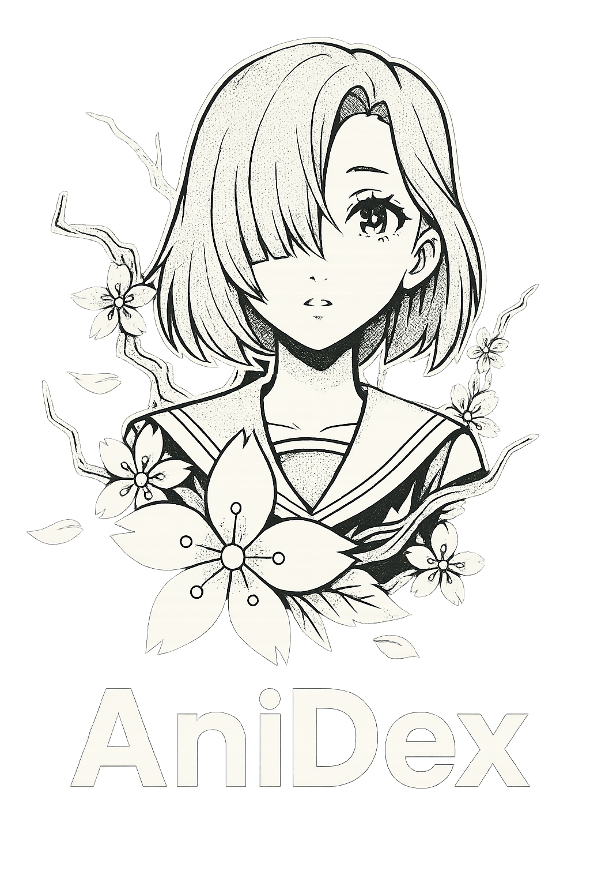
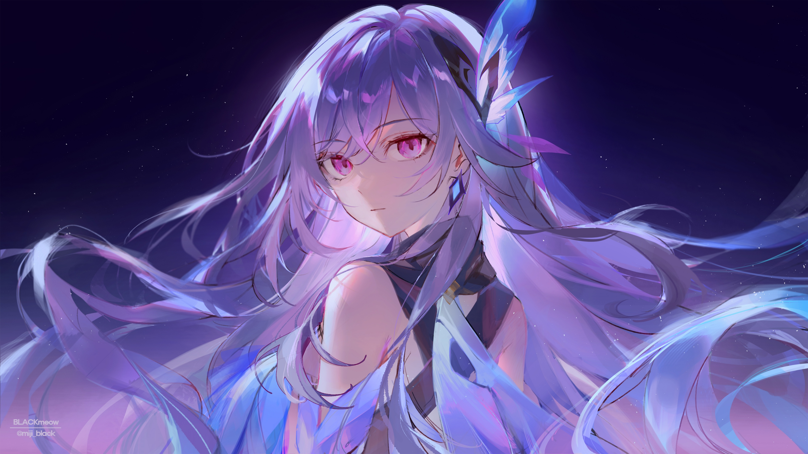
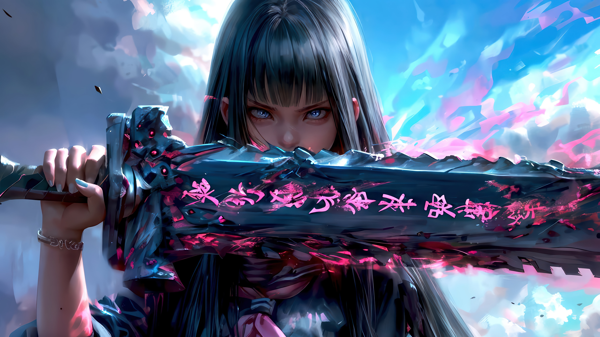
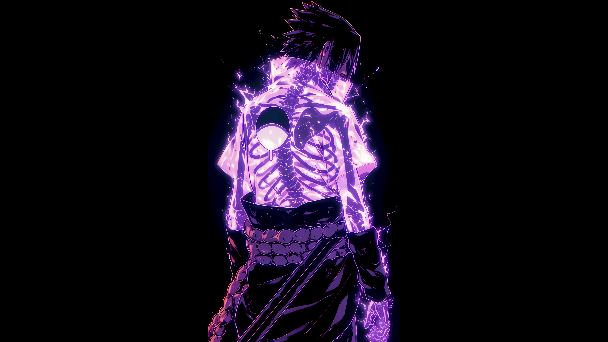
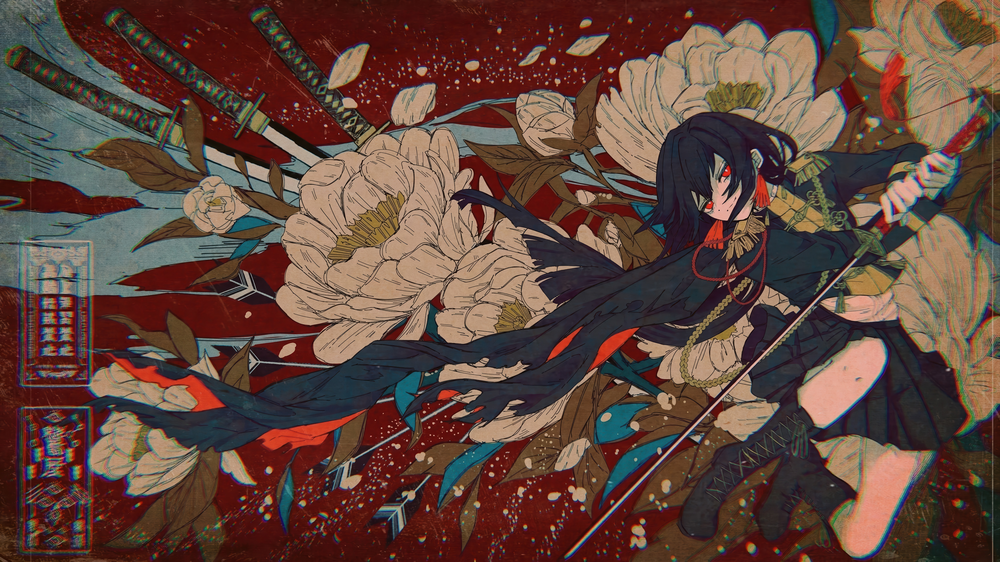
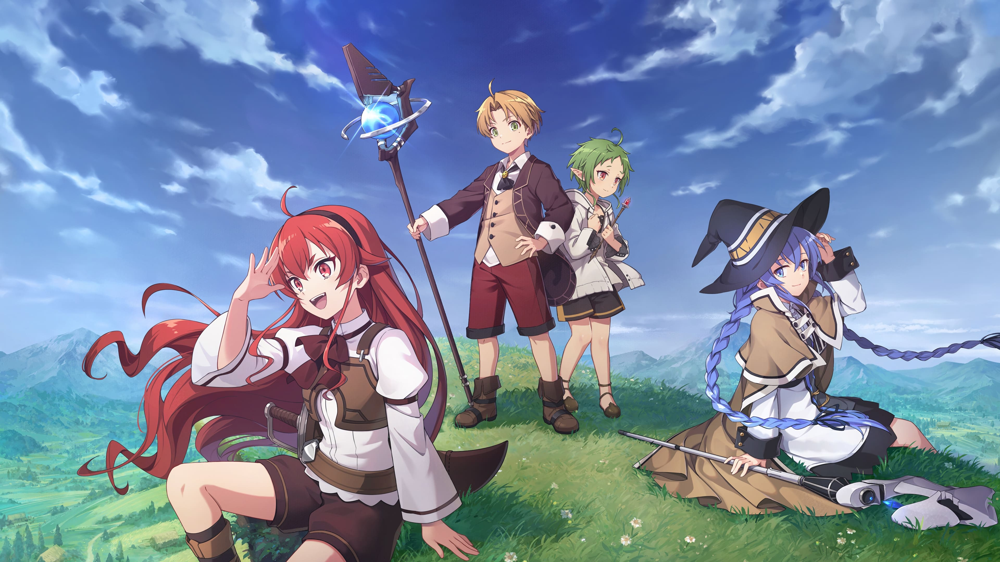
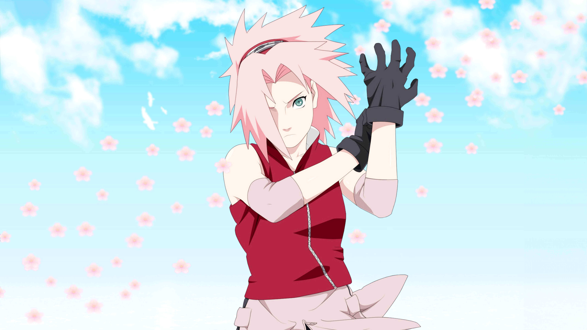
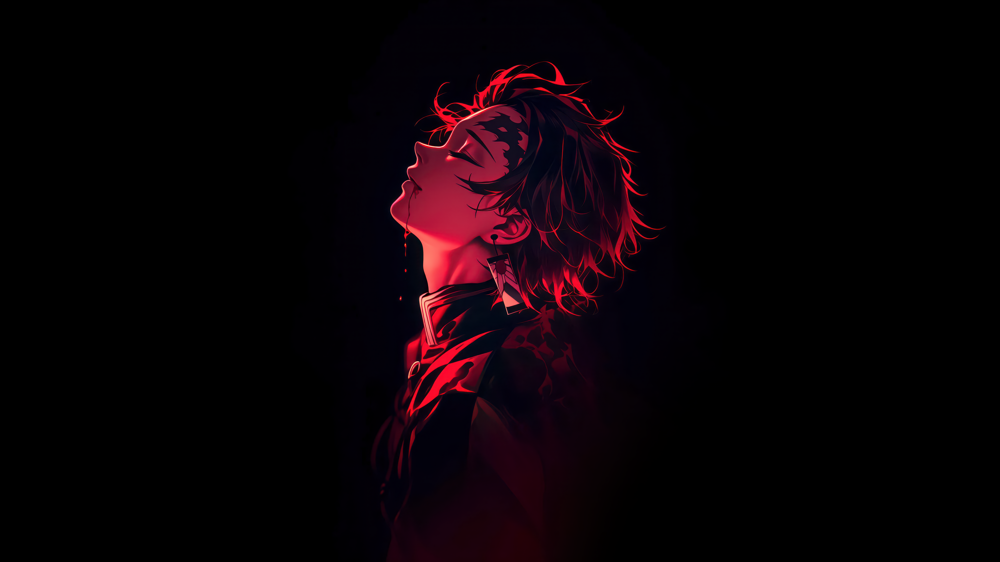

  
  <h1 style="margin:12px 0 0 0;color:#f7f3cf;font-family:Orbitron,Arial,sans-serif;letter-spacing:.07em;text-transform:uppercase;">AniDex — Anime Database</h1>
  
Busque, explore e conheça animes, mangás, personagens e estúdios em uma experiência moderna, responsiva e temática. Projeto educacional sem fins lucrativos, consumindo dados públicos via Jikan (MyAnimeList) e tradução assistida por serviços públicos.

  

    
    
    
    
  

<h2 id="sumario" style="color:#f7f3cf;font-family:Orbitron,Arial,sans-serif;letter-spacing:.07em;text-transform:uppercase;">Sumário</h2>
<ul style="line-height:1.6;color:#fff;">
  <li><a href="#sobre" style="color:#36cecc;">Sobre</a></li>
  <li><a href="#funcionalidades" style="color:#36cecc;">Funcionalidades</a></li>
  <li><a href="#telas" style="color:#36cecc;">Telas e Fluxos</a></li>
  <li><a href="#arquitetura" style="color:#36cecc;">Arquitetura &amp; Tecnologias</a></li>
  <li><a href="#componentes" style="color:#36cecc;">Componentes (Custom + Mantine)</a></li>
<li><a href="#execucao" style="color:#36cecc;">Como executar localmente</a></li>
  <li><a href="#build-deploy" style="color:#36cecc;">Build &amp; Deploy (GitHub Pages)</a></li>
  <li><a href="#limitacoes" style="color:#36cecc;">Limitações e Observações</a></li>
  <li><a href="#snippets" style="color:#36cecc;">Trechos de Código (Snippets)</a></li>
  <li><a href="#creditos" style="color:#36cecc;">Créditos &amp; Licença</a></li>
  <li><a href="#customizacoes" style="color:#36cecc;">Dicas de Customização</a></li>
  <li><a href="#screenshots" style="color:#36cecc;">Imagens</a></li>
  
</ul>

<h2 id="sobre" style="color:#f7f3cf;font-family:Orbitron,Arial,sans-serif;letter-spacing:.07em;text-transform:uppercase;">Sobre</h2>

O AniDex é um projeto pessoal de <strong style="color:#36cecc;">Gabriel Mazzuco</strong> com foco educacional. Ele demonstra boas práticas de UI/UX com React, integração com API pública (Jikan) e uso de paleta dinâmica extraída de wallpapers, proporcionando uma experiência imersiva e elegante. Não há fins comerciais; imagens e dados pertencem aos respectivos autores/serviços.

<h2 id="funcionalidades" style="color:#f7f3cf;font-family:Orbitron,Arial,sans-serif;letter-spacing:.07em;text-transform:uppercase;">Funcionalidades</h2>
<ul style="color:#fff;line-height:1.75;letter-spacing:.02em;">
  <li><strong style="color:#36cecc;">Busca de Animes</strong>: pesquisa por nome, cards com efeito “stagger reveal”, detalhes no Drawer com imagens (carousel) e personagens.</li>
  <li><strong style="color:#36cecc;">Busca de Mangás</strong>: fluxo semelhante ao de animes com Drawer, imagens e personagens relacionados.</li>
  <li><strong style="color:#36cecc;">Personagens</strong>: ranking “Top Characters” e busca por nome, tabela com scroll infinito e hover-cards que mostram dados do anime/mangá relacionado.</li>
  <li><strong style="color:#36cecc;">Produtores/Estúdios</strong>: listagem com busca, detalhes com “about” traduzido e principais obras.</li>
  <li><strong style="color:#36cecc;">Explorar Temporadas</strong>: filtre por ano/estação (Inverno/Primavera/Verão/Outono) e gêneros; Drawer com imagens e elenco do anime.</li>
  <li><strong style="color:#36cecc;">Top Animes</strong>: tabela com infinite scroll; Drawer com sinopse, status, nota e galeria.</li>
  <li><strong style="color:#36cecc;">Tradução automática</strong>: sinopse/status “en → pt-BR” usando provedores públicos (MyMemory, fallback LibreTranslate), com mensagens de sucesso/aviso.</li>
  <li><strong style="color:#36cecc;">Tema dinâmico</strong>: paleta de cores extraída do wallpaper da tela, aplicada a variáveis CSS para estilização consistente.</li>
  <li><strong style="color:#36cecc;">Painel Dev</strong>: ajuste de limites por página (até 25 por restrição do Jikan), modo de depuração com Drawer que exibe o último payload das APIs.</li>
  <li><strong style="color:#36cecc;">Navegação SPA</strong>: rotas com React Router; compatível com GitHub Pages (basename e 404.html).</li>
  <li><strong style="color:#36cecc;">Responsividade</strong>: layout otimizado para desktop, tablets e smartphones.</li>
  <li><strong style="color:#36cecc;">Acessibilidade e feedback</strong>: alerts não intrusivos, overlays de carregamento e foco no conteúdo.</li>
  <li><strong style="color:#36cecc;">Persistência local</strong>: preferências guardadas em <code>localStorage</code> (dev mode, limites de paginação, etc.).</li>
  <li><strong style="color:#36cecc;">Deploy simplificado</strong>: script de publicação para o GitHub Pages.</li>
  
</ul>

<h2 id="telas" style="color:#f7f3cf;font-family:Orbitron,Arial,sans-serif;letter-spacing:.07em;text-transform:uppercase;">Telas e Fluxos</h2>

<h3 style="color:#E8D4B7;text-transform:uppercase;letter-spacing:.07em;">1) Intro</h3>

Tela inicial com logo, aviso de uso educacional, links rápidos e modais de “Sobre” e “Tecnologias”. A paleta é derivada do wallpaper carregado aleatoriamente.

<h3 style="color:#E8D4B7;text-transform:uppercase;letter-spacing:.07em;">2) Menu de Seleção</h3>

Cards grandes levam às áreas principais: buscar animes, mangás, personagens, produtores, explorar temporadas e ver o ranking de animes.

<h3 style="color:#E8D4B7;text-transform:uppercase;letter-spacing:.07em;">3) Buscar Anime</h3>
<ul style="color:#fff;line-height:1.7;">
  <li>Digite o nome e pressione Enter para buscar.</li>
  <li>Cards com pôster e título (efeito de entrada em cascata).</li>
  <li>Ao clicar, abre um Drawer com: sinopse (traduzida), episódios, status (traduzido), nota, galeria (carousel) e personagens (principais/outros).</li>
  <li>Alerta suave informa contagem de resultados e sucesso/erro de tradução.</li>
  
</ul>

<h3 style="color:#E8D4B7;text-transform:uppercase;letter-spacing:.07em;">4) Buscar Mangá</h3>

Fluxo análogo ao de animes, adaptado a campos de mangás (capítulos, etc.).

<h3 style="color:#E8D4B7;text-transform:uppercase;letter-spacing:.07em;">5) Personagens</h3>
<ul style="color:#fff;line-height:1.7;">
  <li>Tabela com <em>Top Characters</em> ao carregar e busca por nome com debounce.</li>
  <li>Scroll infinito por <code>IntersectionObserver</code>.</li>
  <li>Hover-cards pré-buscam dados do anime/mangá relacionado para exibir score, episódios/capítulos e status.</li>
  
</ul>

<h3 style="color:#E8D4B7;text-transform:uppercase;letter-spacing:.07em;">6) Produtores/Estúdios</h3>
<ul style="color:#fff;line-height:1.7;">
  <li>Lista paginada com busca.</li>
  <li>Drawer com logo, nome, fundação, favoritos, “também conhecido como”, link para MAL, “Sobre” (com tradução) e principais obras.</li>
  
</ul>

<h3 style="color:#E8D4B7;text-transform:uppercase;letter-spacing:.07em;">7) Explorar Temporadas</h3>
<ul style="color:#fff;line-height:1.7;">
  <li>Filtros de ano, estação e gêneros (derivados dos dados retornados).</li>
  <li>Filtro de conteúdo adulto respeita seleção por gênero “Hentai”.</li>
  <li>Drawer com sinopse/status traduzidos, nota, galeria e elenco.</li>
  
</ul>

<h3 style="color:#E8D4B7;text-transform:uppercase;letter-spacing:.07em;">8) Top Animes</h3>
<ul style="color:#fff;line-height:1.7;">
  <li>Tabela com ranking, pôster, score e ID (MAL).</li>
  <li>Scroll infinito carrega mais páginas conforme o limite configurado.</li>
  <li>Drawer ricamente formatado com tradução e carrossel.</li>
  
</ul>

<h3 style="color:#E8D4B7;text-transform:uppercase;letter-spacing:.07em;">9) Painel de Configurações (Dev)</h3>
<ul style="color:#fff;line-height:1.7;">
  <li>Ativa o <strong>Dev Mode</strong> (mostra um botão flutuante “Debug JSON” em todas as telas).</li>
  <li>Ajusta os limites de paginação de <strong>Animes</strong> e <strong>Personagens</strong> (até 25 por restrição da API).</li>
  <li>Preferências são persistidas em <code>localStorage</code>.</li>
  
</ul>

<h2 id="detalhamento-telas" style="color:#f7f3cf;font-family:Orbitron,Arial,sans-serif;letter-spacing:.07em;text-transform:uppercase;">Detalhamento das Telas</h2>

<h3 style="color:#E8D4B7;text-transform:uppercase;letter-spacing:.07em;">Intro</h3>
<ul style="color:#fff;line-height:1.7;">
  <li><strong>Propósito</strong>: Apresentação do projeto, aviso educacional, links rápidos e modais de “Sobre” e “Tecnologias”.</li>
  <li><strong>Componentes</strong>: BackgroundImage, Title, Text, Image, Group, Tooltip, ActionIcon, CenteredModal, LogoBaseboard.</li>
  <li><strong>Experiência</strong>: Wallpaper aleatório com paleta extraída, overlay sutil, tipografia Orbitron/Raleway e botões com tooltip.</li>
  <li><strong>Interações</strong>: Abertura de modais, link externo do GitHub, exibição de créditos animados no rodapé.</li>
</ul>

<h3 style="color:#E8D4B7;text-transform:uppercase;letter-spacing:.07em;">Menu de Seleção</h3>
<ul style="color:#fff;line-height:1.7;">
  <li><strong>Propósito</strong>: Central de navegação para todas as features.</li>
  <li><strong>Componentes</strong>: BackgroundImage, Container, Box, Title, Text, Sidebar.</li>
  <li><strong>Experiência</strong>: Cards responsivos com imagens, bordas na cor do tema, transição hover e grid 1→2 colunas.</li>
  <li><strong>Interações</strong>: Clique no card redireciona para a rota correspondente.</li>
</ul>

<h3 style="color:#E8D4B7;text-transform:uppercase;letter-spacing:.07em;">Buscar Anime</h3>
<ul style="color:#fff;line-height:1.7;">
  <li><strong>Entrada</strong>: TextInput com Enter para disparar busca.</li>
  <li><strong>Feedback</strong>: AlertBox para sucesso/erro/aviso, overlay de Loading.</li>
  <li><strong>Listagem</strong>: Grid responsiva; efeito “stagger reveal” nos cards.</li>
  <li><strong>Detalhes</strong>: InfoDrawer com imagem de capa, sinopse (tradução automática), episódios, status (traduzido), nota, carrossel de imagens e seções de personagens (principais/outros).</li>
  <li><strong>APIs</strong>: searchAnimeByName, getAnimePictures, getAnimeCharacters; translateText/translateTextDetailed.</li>
</ul>

<h3 style="color:#E8D4B7;text-transform:uppercase;letter-spacing:.07em;">Buscar Mangá</h3>
<ul style="color:#fff;line-height:1.7;">
  <li><strong>Entrada</strong>: TextInput com Enter; limpeza de resultados ao digitar.</li>
  <li><strong>Detalhes</strong>: Drawer com capa, sinopse traduzida, capítulos, status traduzido, nota, carrossel e personagens.</li>
  <li><strong>APIs</strong>: searchMangaByName, getMangaPictures, getMangaCharacters.</li>
</ul>

<h3 style="color:#E8D4B7;text-transform:uppercase;letter-spacing:.07em;">Personagens</h3>
<ul style="color:#fff;line-height:1.7;">
  <li><strong>Modos</strong>: Top inicial (getTopCharacters) e busca por nome (searchCharactersByName) com debounce.</li>
  <li><strong>Listagem</strong>: Tabela com cabeçalho “sticky”, rank e favoritos; infinite scroll via IntersectionObserver.</li>
  <li><strong>Detalhes</strong>: InfoDrawer com foto, nome, favoritos, “Aparece em” (animes e mangas) com Pill + HoverCard; hovers pré-buscam dados para resumo.</li>
</ul>

<h3 style="color:#E8D4B7;text-transform:uppercase;letter-spacing:.07em;">Produtores/Estúdios</h3>
<ul style="color:#fff;line-height:1.7;">
  <li><strong>Listagem</strong>: Tabela paginada com logo e nome; infinite scroll.</li>
  <li><strong>Detalhes</strong>: Drawer com nome oficial, fundação, favoritos, sinônimos (Pill), link MAL, “Sobre” com tradução e obras em destaque.</li>
  <li><strong>APIs</strong>: getProducers, searchProducersByName, getProducerFull.</li>
</ul>

<h3 style="color:#E8D4B7;text-transform:uppercase;letter-spacing:.07em;">Explorar Temporadas</h3>
<ul style="color:#fff;line-height:1.7;">
  <li><strong>Filtros</strong>: Ano (NumberInput), Estação (Select) e Gêneros (MultiSelect) derivados dos resultados.</li>
  <li><strong>Segurança</strong>: Filtro para conteúdo +18 resguardado (Hentai) a partir de gêneros/classificação.</li>
  <li><strong>Detalhes</strong>: Drawer completo com sinopse/status traduzidos, nota, carrossel e personagens.</li>
  <li><strong>APIs</strong>: getAnimeBySeason (+ getAnimePictures, getAnimeCharacters para o Drawer).</li>
</ul>

<h3 style="color:#E8D4B7;text-transform:uppercase;letter-spacing:.07em;">Top Animes</h3>
<ul style="color:#fff;line-height:1.7;">
  <li><strong>Listagem</strong>: Tabela com rank, pôster, título e score; infinite scroll.</li>
  <li><strong>Detalhes</strong>: Drawer com sinopse/status traduzidos, episódios, nota e carrossel.</li>
  <li><strong>APIs</strong>: getTopAnime + translateTextDetailed.</li>
</ul>

<h2 id="arquitetura" style="color:#f7f3cf;font-family:Orbitron,Arial,sans-serif;letter-spacing:.07em;text-transform:uppercase;">Arquitetura &amp; Tecnologias</h2>
<ul style="color:#fff;line-height:1.7;">
  <li><strong style="color:#36cecc;">React 19 + Vite 7 + TypeScript</strong> — base moderna e rápida.</li>
  <li><strong style="color:#36cecc;">Mantine UI</strong> — componentes (Drawer, Modal, Carousel, Tabela, etc.).</li>
  <li><strong style="color:#36cecc;">Tailwind CSS 4</strong> — utilitários de layout/spacing/resp.</li>
  <li><strong style="color:#36cecc;">Jikan API</strong> — dados de anime/mangá/characters/producers.</li>
  <li><strong style="color:#36cecc;">MyMemory + LibreTranslate</strong> — tradução assistida, com fallback automático.</li>
  <li><strong style="color:#36cecc;">React Router</strong> — rotas SPA; compatível com <code>BASE_URL</code> do Vite.</li>
  <li><strong style="color:#36cecc;">Styled Components</strong> — micro-componente do rodapé animado.</li>
  <li><strong style="color:#36cecc;">LocalStorage</strong> — preferências persistentes do usuário.</li>
</ul>

  
Estrutura de pastas (resumo)

  <pre><code>
src/
  assets/
    API/               # jikan.ts, translate.ts
    components/        # Drawer, Modals, Alerts, Overlays, Sidebar...
    images/            # wallpapers e logos usados nas telas
    inputInfos/        # CSS Modules com tema aplicado aos inputs
  screens/             # Intro, Selection, Search*, TopAnimes, Seasons, Producers, Dev
  state/               # SettingsProvider (dev mode, limites, payloads)
  utils/               # palette.ts (tema dinâmico), wallpaper.ts, responsive.ts
  index.css            # reset + variáveis CSS + fontes + scrollbar
  main.tsx             # Router + Provider + Mantine
  vite-env.d.ts
  </code></pre>

<h2 id="componentes" style="color:#f7f3cf;font-family:Orbitron,Arial,sans-serif;letter-spacing:.07em;text-transform:uppercase;">Componentes (Custom + Mantine)</h2>

<h3 style="color:#E8D4B7;text-transform:uppercase;letter-spacing:.07em;">Componentes personalizados</h3>
<ul style="color:#fff;line-height:1.7;">
  <li><strong>Sidebar</strong> (<code>src/assets/components/sidebar.tsx</code>): menu lateral responsivo com colapso, overlay, atalhos e botão Dev “Debug JSON”.</li>
  <li><strong>InfoDrawer</strong> (<code>src/assets/components/infoDrawer.tsx</code>): wrapper de Drawer do Mantine com API simplificada para injetar conteúdo.</li>
  <li><strong>CenteredModal</strong> (<code>src/assets/components/centerModal.tsx</code>): Modal centralizado com tema aplicado via CSS Modules.</li>
  <li><strong>AlertBox</strong> (<code>src/assets/components/alert.tsx</code>): alerta flutuante com animação enter/exit e acentos por tipo.</li>
  <li><strong>LoadingOverlayFullscreen</strong> (<code>src/assets/components/overlay.tsx</code>): overlay de carregamento de tela cheia com mensagem opcional.</li>
  <li><strong>LogoBaseboard</strong> (<code>src/assets/components/logoBaseboard.tsx</code>): assinatura animada usando styled-components.</li>
  <li><strong>LoaderBox</strong> (<code>src/assets/components/loaderBox.tsx</code>): placeholder de carregamento em áreas internas (sinopse/status).</li>
  <li><strong>SettingsProvider</strong> (<code>src/state/settings.tsx</code>): contexto com preferências (dev mode, limites, payloads de debug) persistidas em localStorage.</li>
  <li><strong>Palette/Wallpaper</strong> (<code>src/utils/palette.ts</code> / <code>src/utils/wallpaper.ts</code>): extração de paleta e rotação de wallpapers com import.meta.glob.</li>
</ul>

<h3 style="color:#E8D4B7;text-transform:uppercase;letter-spacing:.07em;">Principais componentes do Mantine</h3>
<ul style="color:#fff;line-height:1.7;">
  <li><strong>Layout</strong>: BackgroundImage, Container, Box, Group, Grid, Space, Divider.</li>
  <li><strong>Tipografia/Mídia</strong>: Title, Text, Image, ThemeIcon, Pill.</li>
  <li><strong>Inputs</strong>: TextInput, NumberInput, Select, MultiSelect, Switch, ActionIcon, Tooltip, JsonInput.</li>
  <li><strong>Feedback</strong>: Drawer, Modal, Alert, Overlay, Loader.</li>
  <li><strong>Carrossel</strong>: <code>@mantine/carousel</code> com Embla + Autoplay para galerias.</li>
  <li><strong>Tabelas</strong>: Table com cabeçalho sticky (estilizada por CSS Modules).</li>
</ul>

<h2 id="telas-extra" style="color:#f7f3cf;font-family:Orbitron,Arial,sans-serif;letter-spacing:.07em;text-transform:uppercase;">Telas — detalhes adicionais</h2>

Pré-requisitos:

<ul style="color:#fff;line-height:1.7;">
  <li><strong>Node.js 18+</strong> (recomendado 20 LTS) e <strong>npm</strong>.</li>
  <li>Permissão de rede para acessar <code>https://api.jikan.moe</code> e serviços de tradução.</li>
  <li>NÃO abra o <code>index.html</code> direto no navegador (file://). Use o servidor do Vite.</li>
</ul>

<h2 id="execucao" style="color:#f7f3cf;font-family:Orbitron,Arial,sans-serif;letter-spacing:.07em;text-transform:uppercase;">Como executar localmente</h2>

Pré-requisitos:

<ul style="color:#fff;line-height:1.7;">
  <li><strong>Node.js 18+</strong> (recomendado 20 LTS) e <strong>npm</strong>.</li>
  <li>Permissão de rede para acessar https://api.jikan.moe e serviços de tradução.</li>
  <li>Não abra <em>index.html</em> via <em>file://</em>; use o servidor do Vite.</li>
</ul>

  
1) Instalar dependências

  
Execute no diretório do projeto:

  
npm install

  
2) Rodar em desenvolvimento (http://localhost:5173)

  
npm run dev

  
3) Build de produção

  
npm run build

  
4) Pré-visualizar o build

  
npm run preview

<h2 id="build-deploy" style="color:#f7f3cf;font-family:Orbitron,Arial,sans-serif;letter-spacing:.07em;text-transform:uppercase;">Build &amp; Deploy (GitHub Pages)</h2>
<ul style="color:#fff;line-height:1.7;">
  <li>O projeto define <strong>base</strong> em <em>vite.config.ts</em> como <strong>/anime-database/</strong> e duplica <em>index.html</em> em <em>404.html</em> após o build.</li>
  <li>O script <strong>deploy</strong> publica <em>dist/</em> no branch <strong>gh-pages</strong>.</li>
</ul>

  
Publicar

  
Gere e publique:

  
npm run build

  
npm run deploy

  
No GitHub, configure Pages para o branch <strong>gh-pages</strong> (root).

<h2 id="limitacoes" style="color:#f7f3cf;font-family:Orbitron,Arial,sans-serif;letter-spacing:.07em;text-transform:uppercase;">Limitações e Observações</h2>
<ul style="color:#fff;line-height:1.8;">
  <li><strong>Limites da Jikan API</strong>: a API impõe <em>rate limit</em> e retorna no máximo 25 itens por página. O projeto agrega páginas quando possível; as telas de Dev permitem ajustar o limite até 25.</li>
  <li><strong>Tradução pública</strong>: MyMemory e LibreTranslate são serviços sem chave e possuem restrições. Em caso de falha, a aplicação mostra o texto original e exibe um alerta.</li>
  <li><strong>Execução local</strong>: não use <code>file://</code>. É necessário rodar com Vite (<code>npm run dev</code>) para resolver módulos, CSS e assets.</li>
  <li><strong>GitHub Pages</strong>: se renomear o repositório, ajuste <code>base</code> em <code>vite.config.ts</code> e garanta que <code>BrowserRouter</code> use <code>import.meta.env.BASE_URL</code> (já está no projeto).</li>
  <li><strong>Favicon</strong>: em <code>index.html:5</code> há um <code>&lt;link rel="icon" ...&gt;</code> para <code>public/images/imgLogo/sailor.png</code>. Você pode trocar por outro arquivo em <code>public/images/</code>.</li>
  <li><strong>Privacidade</strong>: o projeto não coleta dados pessoais; apenas usa <code>localStorage</code> para preferências locais.</li>
</ul>

<h2 id="snippets" style="color:#f7f3cf;font-family:Orbitron,Arial,sans-serif;letter-spacing:.07em;text-transform:uppercase;">Trechos de Código (Snippets)</h2>

<h3 style="color:#E8D4B7;text-transform:uppercase;letter-spacing:.07em;">Rotas com basename (SPA + Pages)</h3>

  
src/main.tsx (trecho)

  
Definição de basename para compatibilidade com GitHub Pages.

  

const basename = import.meta.env.BASE_URL.replace(/\/$/, '');

&lt;BrowserRouter basename={basename}&gt;
&lt;Routes&gt;
&lt;Route path="/" element={&lt;IntroScreen /&gt;} /&gt;
&lt;Route path="/selectionScreen" element={&lt;SelectionScreen /&gt;} /&gt;
&lt;Route path="/searchScreen" element={&lt;SearchScreen /&gt;} /&gt;
{/_ ...demais rotas... _/}
&lt;/Routes&gt;
&lt;/BrowserRouter&gt;

  

<h3 style="color:#E8D4B7;text-transform:uppercase;letter-spacing:.07em;">Consulta na Jikan API</h3>

  
src/assets/API/jikan.ts (trecho)

  
Busca por nome na Jikan API.

  

export async function searchAnimeByName(name: string) {
  const response = await fetch(`https://api.jikan.moe/v4/anime?q=${encodeURIComponent(name)}`);
  if (!response.ok) throw new Error('Falha ao buscar animes');
  return response.json();
}
  

<h3 style="color:#E8D4B7;text-transform:uppercase;letter-spacing:.07em;">Tradução com fallback</h3>

  
src/assets/API/translate.ts (trecho)

  
Fallback automático: MyMemory → LibreTranslate.

  

export async function translateTextDetailed(text: string, from='en', to='pt-BR') {
  // 1) Tenta MyMemory (GET)
  // 2) Se falhar, cai para LibreTranslate (POST)
  // 3) Se falhar, retorna o texto original
}
  

<h3 style="color:#E8D4B7;text-transform:uppercase;letter-spacing:.07em;">Tema dinâmico via paleta do wallpaper</h3>

  
src/utils/palette.ts (uso)

  
Aplica paleta extraída do wallpaper às variáveis CSS.

  

useEffect(() =&gt; {
  if (!wallpaper) return;
  extractPaletteFromImage(wallpaper)
    .then(applyPaletteToCssVariables)
    .catch(() =&gt; {});
}, [wallpaper]);
  

<h3 style="color:#E8D4B7;text-transform:uppercase;letter-spacing:.07em;">Scroll infinito com IntersectionObserver</h3>

  
IntersectionObserver

  
Carrega mais itens ao cruzar o sentinel (infinite scroll).

  

const observer = new IntersectionObserver((entries) =&gt; {
  const entry = entries[0];
  if (!entry?.isIntersecting) return;
  if (isLoadingMore || !hasMore) return;
  // carrega próxima página...
}, { root, rootMargin: '0px 0px 200px 0px', threshold: 0.05 });

observer.observe(sentinel);
return () =&gt; observer.disconnect();

  

<h3 style="color:#E8D4B7;text-transform:uppercase;letter-spacing:.07em;">Vite base para GitHub Pages</h3>

  
vite.config.ts (trecho)

  
Base e plugins configurados para GitHub Pages.

  

export default defineConfig({
  base: '/anime-database/',
  plugins: [react(), tailwindcss()],
});
  

<h2 id="customizacoes" style="color:#f7f3cf;font-family:Orbitron,Arial,sans-serif;letter-spacing:.07em;text-transform:uppercase;">Dicas de Customização</h2>
<ul style="color:#fff;line-height:1.7;">
  <li><strong>Favicon</strong>: troque <code>public/images/imgLogo/sailor.png</code> e atualize o caminho em <code>index.html:5</code>.</li>
  <li><strong>Nome/base do projeto</strong>: altere <code>base</code> em <code>vite.config.ts</code> caso o repositório tenha outro nome.</li>
  <li><strong>Cores padrão</strong>: ajuste variáveis em <code>src/index.css</code> (ex.: <code>--color1</code>, <code>--accent</code>, <code>--panel-bg</code>).</li>
  <li><strong>Wallpapers</strong>: adicione/remova arquivos nas pastas <code>src/assets/images/wallpaper*/</code>; o carregamento usa <code>import.meta.glob</code>.</li>
  <li><strong>Limites de paginação</strong>: use o Painel Dev para mudar de forma persistente (até 25).</li>
</ul>

<h2 id="screenshots" style="color:#f7f3cf;font-family:Orbitron,Arial,sans-serif;letter-spacing:.07em;text-transform:uppercase;">Imagens</h2>

Alguns dos assets visuais utilizados no tema:

  
  
  
  
  
  
  
  

<h2 id="creditos" style="color:#f7f3cf;font-family:Orbitron,Arial,sans-serif;letter-spacing:.07em;text-transform:uppercase;">Créditos &amp; Licença</h2>
<ul style="color:#fff;line-height:1.7;">
  <li>Dados: <a href="https://jikan.moe/" style="color:#36cecc;">Jikan API (MyAnimeList)</a></li>
  <li>Tradução: <a href="https://mymemory.translated.net/" style="color:#36cecc;">MyMemory</a> e <a href="https://libretranslate.com/" style="color:#36cecc;">LibreTranslate</a></li>
  <li>UI: <a href="https://mantine.dev/" style="color:#36cecc;">Mantine UI</a>, <a href="https://tailwindcss.com/" style="color:#36cecc;">Tailwind CSS</a></li>
  <li>Ícones: <a href="https://react-icons.github.io/react-icons/" style="color:#36cecc;">react-icons</a></li>
  <li>Licença: consulte <code>LICENSE</code> neste repositório.</li>
</ul>

Gabriel Mazzuco — 2025

